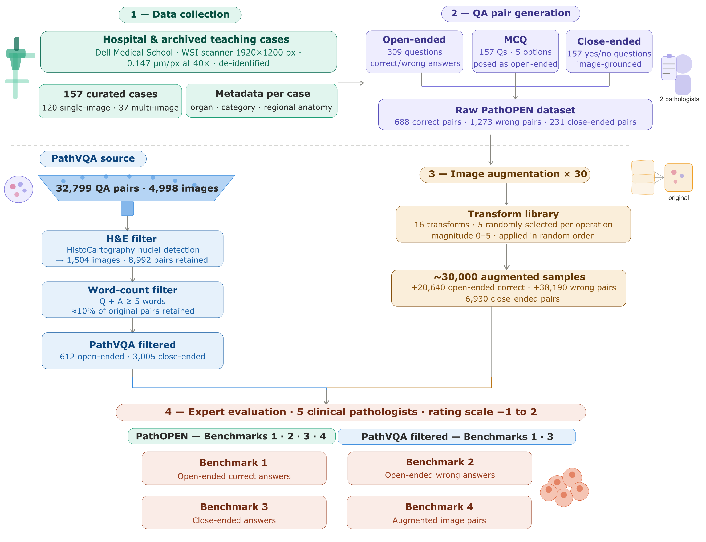

# PathOPEN Dataset
This repository is the main source of the PathOPEN Dataset and it will deal with the following things

- data_analysis_scripts
    - Analysis of RAW PathOPEN Dataset collected by clinical pathologists
    - Augmentation of RAW PathOPEN Dataset using `DIAGNijmegen/pathology-he-auto-augment.git`
    - Analysis and Filtering of PathVQA dataset for fair comparison with PathOPEN dataset

- data_eval_prep_scripts
    - PathOPEN Data Prepration for evaluation
    - PathOPEN Image Augmentation data prepartion for evaluation
    - Filtering of PathVQA H\&E Images using HistoCartography
    - PathVQA Data Preparation for evaluation

- data_eval_analysis_scripts
    - Analysis of the evaluated PathOPEN Data
    - Analysis of the evaluated PathVQA Data
    - Analysis of the evaluated PathOPEN Image Augmentation Data

- data_prep_scripts
    - Preparation of PathOPEN Dataset in JSON for final delivery

For Data Augmentation

1. git clone git@github.com:DIAGNijmegen/pathology-he-autoaugmetation.git or git clone git@github.com:DIAGNijmegen/pathology-he-auto-augment.git
2. pip install scikit-image
3. pip install albumentations==1.1.0
4. Change the following lines in pathology-he-autoaugmetation/randaugment/train/randaugement_new_ranges.py
_REPLACE = 225 -> This will replace the background to a semi-white color to match the slides background
available_ops = ['Scaling','TranslateX', 'TranslateY','ShearX', 'ShearY','Brightness', 'Sharpness','Color', 'Contrast','Rotate','Equalize', 'HsvH','HsvS','HsvV','HedH','HedE','HedD'] -> We are not doing Elastic, Gaussian Blur or Gaussian Noise operation since that tends to disturb the data to an extent which is not identifiable

## Main Workflow of Curating PathOPEN Dataset

